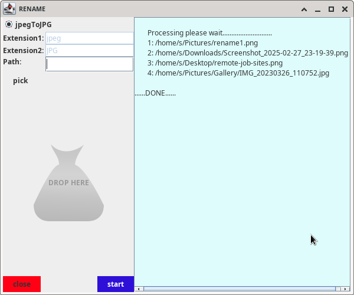

# RENAME

**RENAME** is a Java Swing-based desktop application designed to help users quickly convert and rename image files. The primary use case is to convert images from one file extension (for example, `.jpeg`) to another (for example, `.JPG`), while optionally trying alternative image formats if the conversion using the primary type fails.

---

## Overview

RENAME offers a graphical user interface (GUI) that lets you:

- **Select Files**: Choose images either by using a file picker (via a custom file dialog) or by dragging and dropping files onto the application.
- **Configure Conversion**: By default, the application converts images from `jpeg` to `JPG`. Users can manually enter different source and target extensions.
- **Visual Feedback**: A progress bar and status label provide real-time updates during the conversion process.
- **System Tray Integration**: The app minimizes to the system tray, offering quick access and notifications.
- **Robust Conversion**: If the conversion fails using the initially specified image type, the program attempts fallback conversion formats (such as `png`, `gif`, etc.) until successful.

---

## Features

- **User-Friendly GUI**: Built with Java Swing, the interface includes buttons, text fields, radio buttons, and a progress bar.
- **File Selection**: Use the "Pick" button to open a file dialog (implemented in the `PickFiles` class) that supports selecting multiple files.
- **Drag & Drop Support**: A helper class (referenced as `DropTargetListenerHelper`) is used to enable file drop functionality.
- **Customizable Extensions**: While default conversion is from `jpeg` to `JPG`, you can change both source and target file extensions.
- **Background Processing**: File processing runs in separate threads so the UI remains responsive.
- **Conversion Fallbacks**: In case the initial conversion fails, the program cycles through several common image formats.
- **System Tray Notifications**: A tray icon displays messages and provides quick access to the app.

---

## Prerequisites

- **Java Development Kit (JDK)**: Ensure you have JDK 8 or later installed.
- **Java Runtime Environment (JRE)**: Required to run the compiled application.
- **Libraries Used**:
  - Java Swing (for the GUI)
  - Java AWT (for system tray, image handling, and events)
  - Java Image I/O API (for image conversion)

---

## Installation

1. **Clone the Repository**:
   ```bash
   git clone https://github.com/scansio/rename.git
   ```
2. **Build the Project**:  
   Use your preferred IDE (like IntelliJ IDEA or Eclipse) or build tools such as Maven or Gradle to compile the project.  
   For example, if using Maven:
   ```bash
   mvn clean install
   ```
3. **Resource Files**:  
   Ensure the resource files such as `appIcon.png` and `myFolder.png` (located in `com/resource/`) are in the classpath.

---

## Usage



1. **Run the Application**:  
   Execute the main class:
   ```bash
   java -cp out/artifacts/Rename_jar/Rename.jar com.rename.MainUI
   ```
2. **Select Image Files**:
   - **File Picker**: Click on the "Pick" button (or use Ctrl+O) to open a file dialog for selecting image files.
   - **Drag & Drop**: Drop files directly into the designated drop area in the UI.
3. **Configure Extensions**:
   - By default, the app converts from `jpeg` to `JPG`.
   - To use different extensions, unselect the default radio button to enable custom extension fields.
4. **Start Conversion**:  
   Click the "Start" button (or press Enter in one of the text fields) to begin processing. The application will create a new folder named `renamed_files` in the parent directory of the selected files and save the converted images there.
5. **Stop/Cancel Operation**:  
   Click the "Stop" button to cancel an ongoing conversion.

---

## Code Structure

- **MainUI.java**:
  - Implements the primary user interface.
  - Manages user interactions, file selection, conversion progress, and system tray notifications.
  - Handles the image conversion process with fallbacks.
- **PickFiles.java**:
  - Contains a helper method for file selection using a native file dialog.
  - Supports multi-file selection and customizes the dialog appearance with an icon.
- **(Additional Helper Classes)**:
  - _Logger_: Manages logging within the application.
  - _DropTargetListenerHelper_: Enables drag-and-drop functionality for file selection.
  - _DesameException_: Custom exception used in fallback conversion logic.

---

## Future Improvements

- **Enhanced Error Handling**: Better exception management and user notifications.
- **Support for More Formats**: Extend support for additional image file formats.
- **UI/UX Enhancements**: Improve visual design and add more customization options.
- **Packaging**: Create an installer for easier distribution.

---

## License

This project is licensed under the MIT License – see the [LICENSE](LICENSE) file for details.
